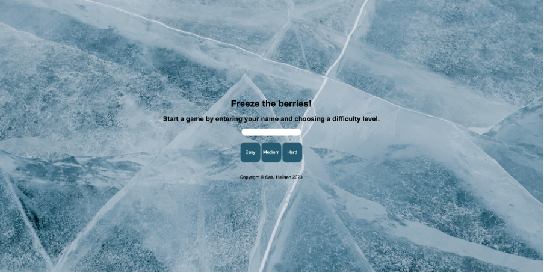
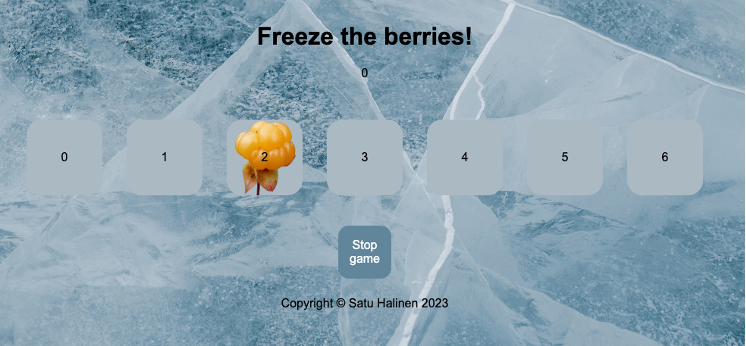
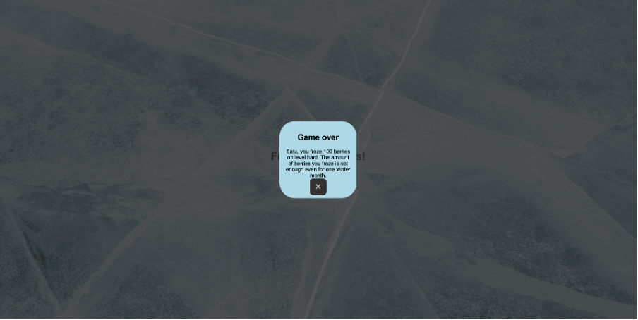

# Speed game React

This speed game is done on a course called React Basics. The game is a React version of the speed game done on a course called Programming JavaScript. The theme is the same as in the game of the JavaScript course. The difference between the games is that the React version has three different difficulty levels.

# Technologies used

- React

# Live page link

https://speedgamereact-c2vxoqpht-satuhalinens-projects.vercel.app/

# Visuals

Choosing the level:

Playing the game:

End of the game:

