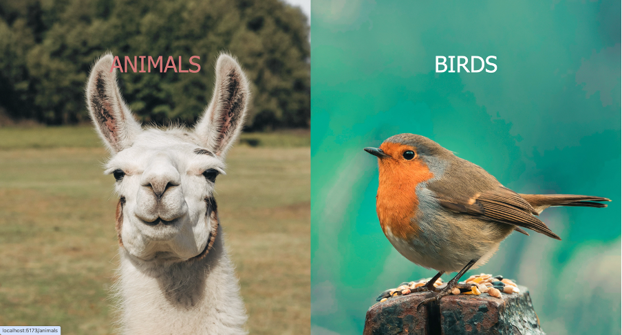
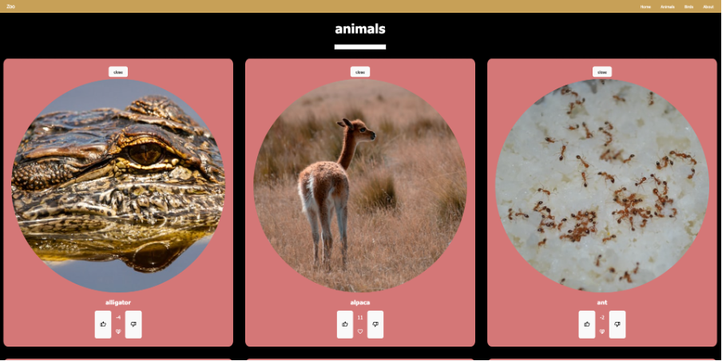
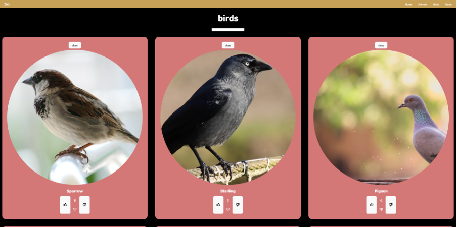
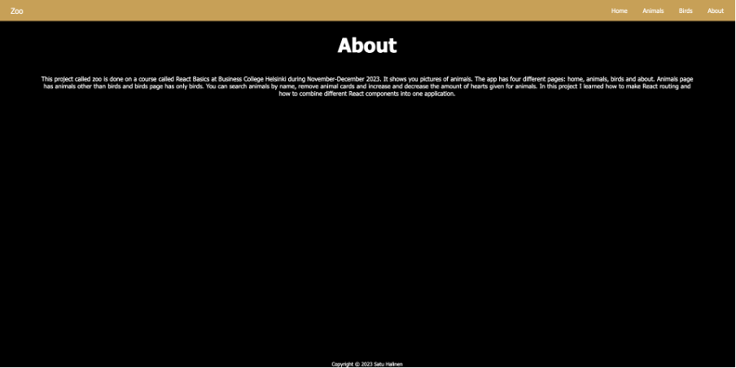

# Zoo

This is a project done on a course called React Basics at Business College Helsinki. It shows you pictures of animals. The app has four different pages: home, animals, birds and about. Animals page has animals other than birds and birds page has only birds. You can search animals by name, remove animal cards and increase and decrease the amount of hearts given for animals. In this project I learned how to make React routing and how to combine different React components into one application.

## Technologies used

- React

## Live page link

## Visuals

Home page:

Animals page:

Birds page:

About page:

